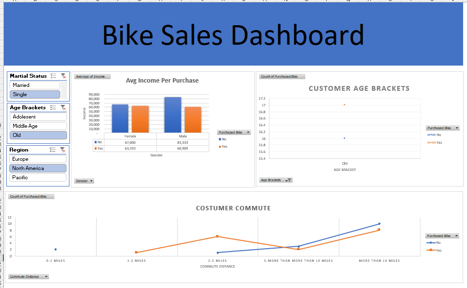

# Bike Sales Analysis Dashboard

## 📊 Tool Used
Microsoft Excel

## 📌 Project Overview
This project analyzes customer purchasing behavior for bike sales based on income, age, and commute distance.

## 🔍 Key Insights
- Customers with higher income are more likely to purchase bikes
- Middle-aged individuals contribute the highest sales
- Shorter commute distances show higher purchase rates

## ⚙️ Features
- Interactive dashboard using Excel
- Customer segmentation analysis
- Income vs purchase visualization

## 📷 Dashboard Preview

