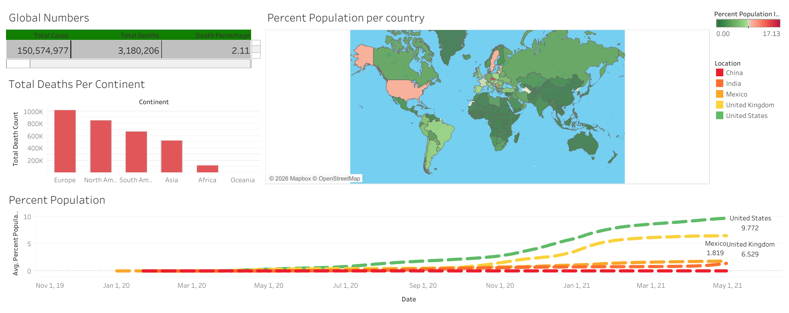

# COVID-19 Data Analysis Dashboard

## 📊 Tool Used
Tableau

## 📌 Project Overview
Analyzed global COVID-19 data to track cases, deaths, and population impact across countries and continents.

## 🔍 Key Insights
- Europe recorded the highest death count
- Rapid growth in cases during 2020–2021
- United States had the highest infection rate
- Death percentage varied across continents

## ⚙️ Features
- Global case tracking
- Death count by continent
- Country-wise population analysis
- Time-series visualization

## 📷 Dashboard Preview

