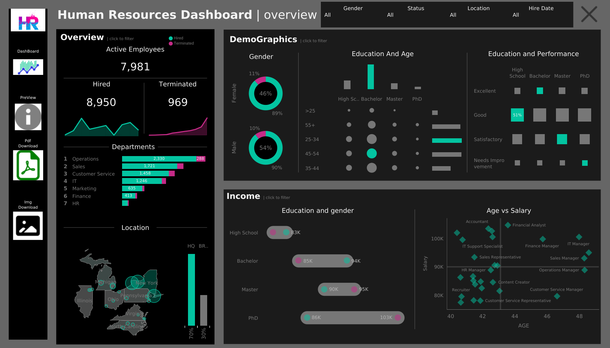

# HR Analytics Dashboard

## 📊 Tool Used
Tableau

## 📌 Project Overview
This dashboard provides insights into employee demographics, salary distribution, and hiring trends.

## 🔍 Key Insights
- Majority employees fall in 25–34 age group
- High hiring rate compared to termination
- Salary varies significantly across job roles
- Balanced gender distribution

## ⚙️ Features
- Employee demographics analysis
- Salary vs age visualization
- Department-wise insights
- Hiring and termination trends

## 📷 Dashboard Preview

