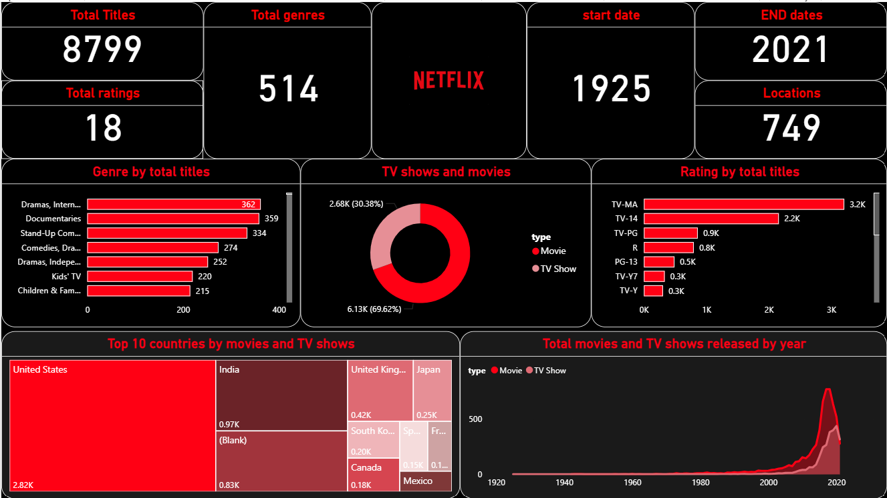

# Netflix Content Analysis Dashboard

## 📊 Tools Used
- Tableau
- Power BI

## 📌 Project Overview
This project analyzes Netflix content data to uncover trends in movies and TV shows across genres, countries, and release years.

## 🔍 Key Insights
- Movies dominate Netflix content (~70%)
- Drama and International Movies are the most popular genres
- United States and India contribute the highest number of titles
- Significant growth in content production after 2015

## ⚙️ Features
- Genre-wise distribution analysis
- Country-based content visualization (map)
- Rating classification (TV-MA, TV-14, etc.)
- Year-wise trend of content growth
- Interactive filtering

## 📷 Dashboard Preview

### Tableau Dashboard

### Power BI Dashboard

